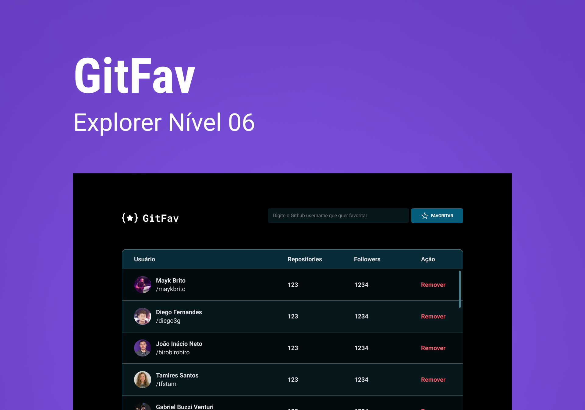

<h1 align="center">
    <a href="#"> Git Fav </a>
</h1>

	
  
	
  
	
  

<h4 align="center"> 
	 Status: Finished
</h4>

 <a href="#-about">About</a> •
 <a href="#-Features">Features</a> •
 <a href="#-layout">Layout</a> • 
 <a href="#-tech-stack">Tech Stack</a> • 
 <a href="#-author">Author</a> • 
 <a href="#-license">License</a>

## 💻 About

Application that lets you save your favorite github friends

- in this project the github API was consumed
  and was organized in the standard of classes with ECMAScript modules

---

### Web

  

---

## 🛠 Tech Stack

The following tools were used in the construction of the project:

#### **Project**

- HTML
- CSS
- Javascript

---

## 🦸 Author

<a href="https://blog.rocketseat.com.br/author/exodo/">
  
  
 <b>Êxodo Gurgel</b></a>  🚀
  

---

## 📝 License

This project is under the license [MIT](./LICENSE).

Made with ❤️ by Êxodo Gurgel 👋🏽 [Get in Touch!](Https://www.linkedin.com/in/exodo-gurgel/)

---
